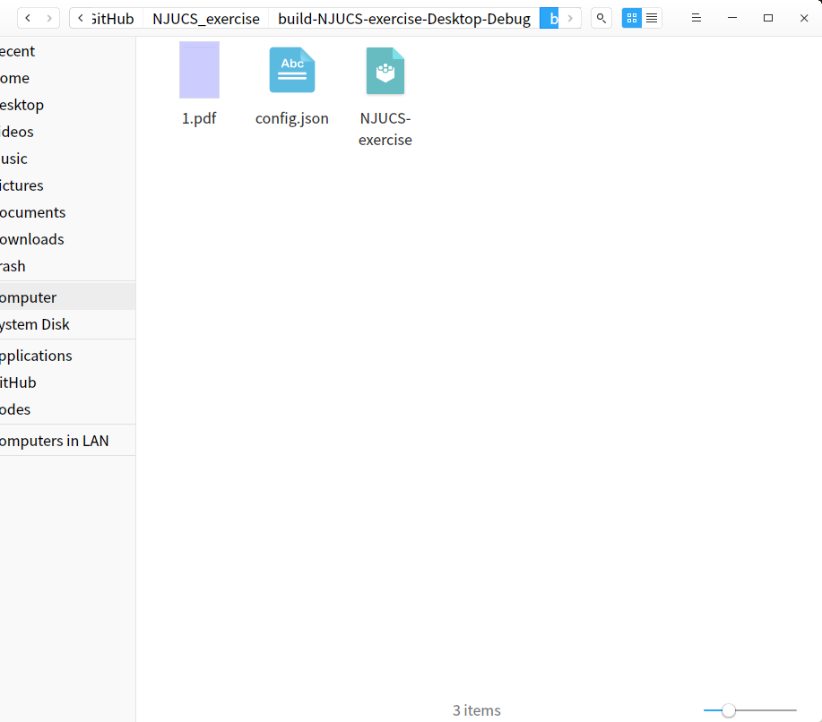
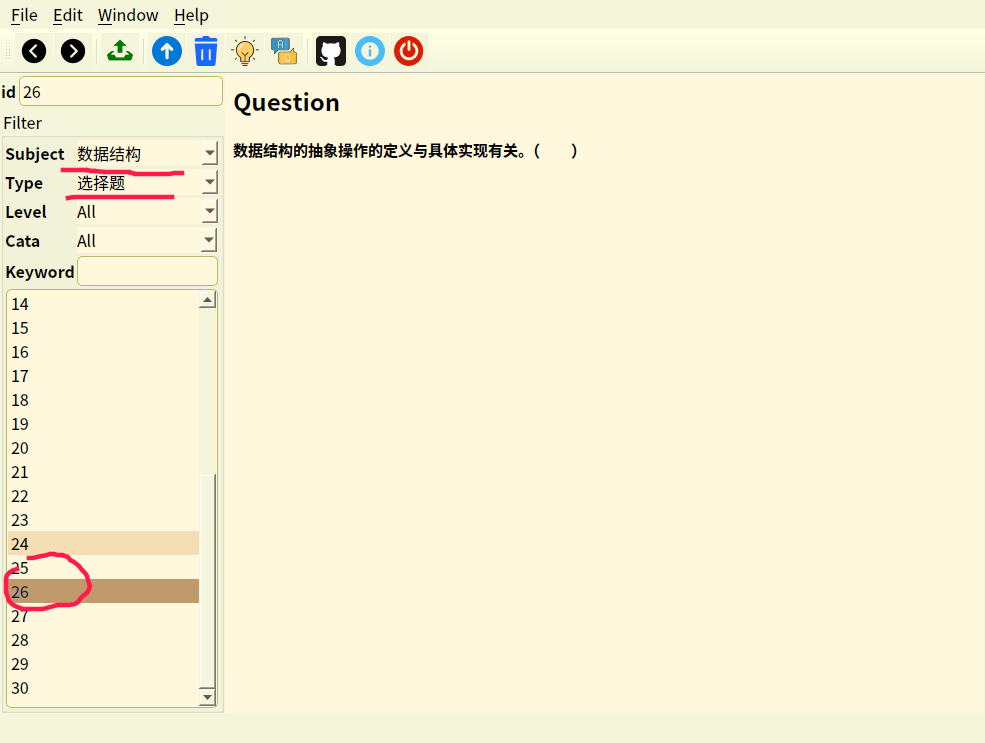
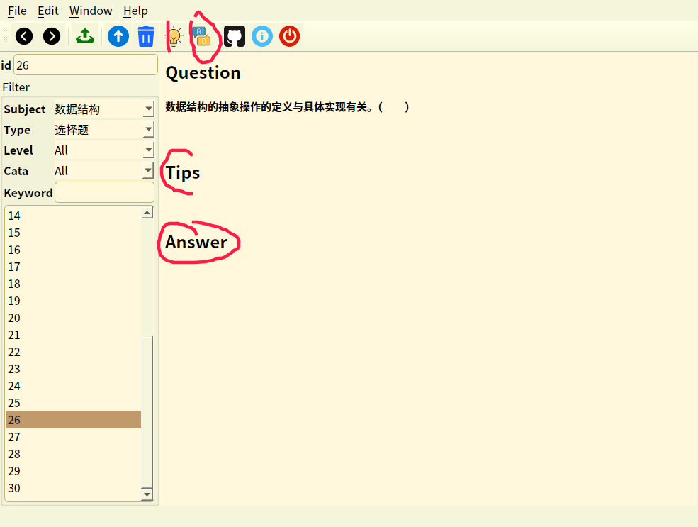
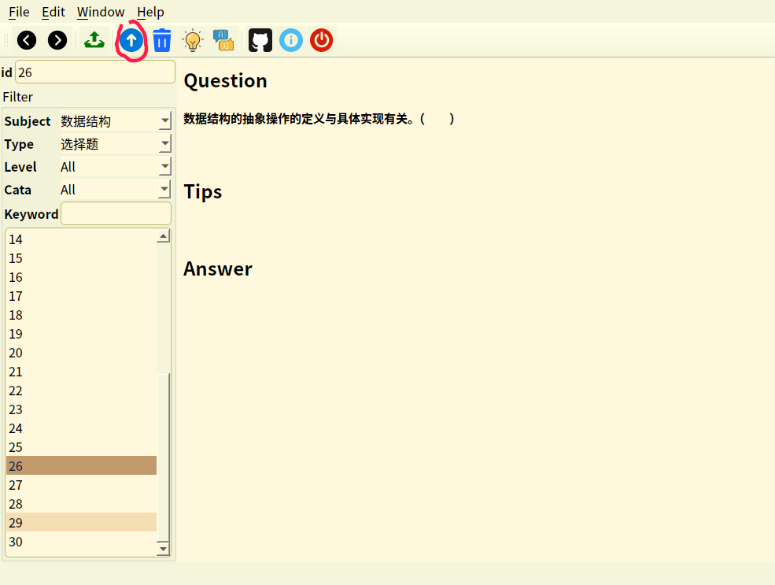
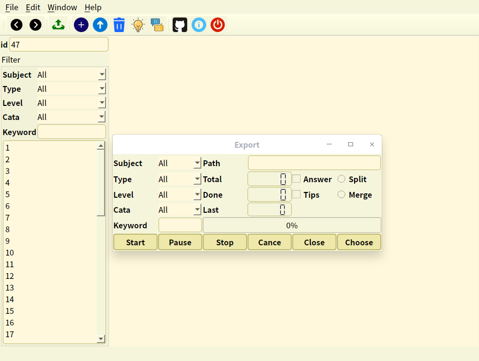
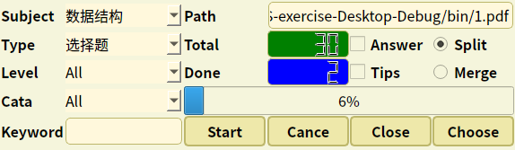
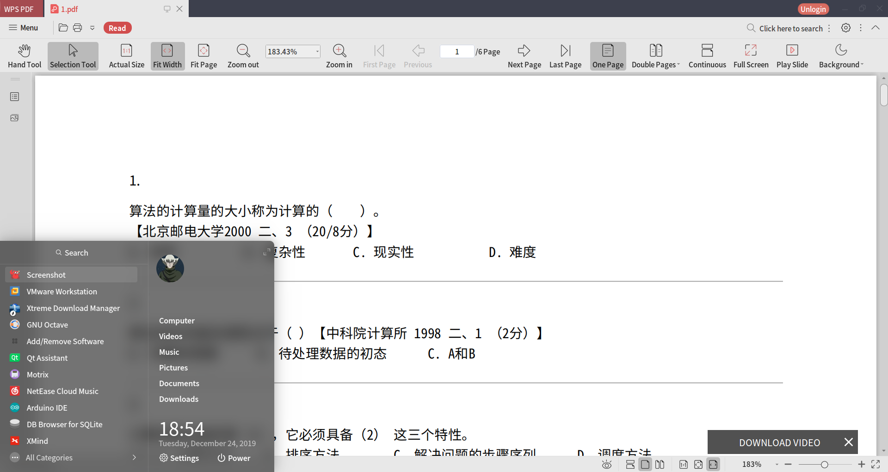

# NJUCS-exercise

NJUCS配套的刷题软件

因为会有公式，为了保证显示效果，推荐pdf导出

软件需要的数据库在release中

## 功能

1、题库数据增删改查；

2、刷题练习；

3、数据分析；

4、题目去重；

5、导出为其他格式文件，如PDF、docx等；

6、提供填空、选择、解答、判断等题型；

文字处理采用HTML格式文本

使用最长句子MD5值进行重复判断

## 配置

OS: Manjaro Linux 18.1.1

Qt: 5.13.1

GCC: 9.2.0

C++: C11

SQL: sqlite3

Git: 2.23.0

## TODO

1、如果data和property表id不一样该如何处理

2、公式只能联网显示的问题

## 软件使用说明

1、使用配置文件

从配置文件中加载数据库位置、皮肤名称、上一次题目ID

2、主界面

如果没有上一次题目ID则显示最大ID

从数据库中加载科目、难度、类型数据列表

3、过滤题目

通过选项进行过滤，然后生成题目ID列表；

每一次过滤会生成新的题目列表；

4、题目

双击上面的题目列表，会加载对应题目的内容并显示；

5、提示和答案

点击tip图标，会在题目下面添加当前题目的提示；

同理可得到答案

6、更新题目

点击update图标，然后会在添加题目的界面显示当前题目的所有信息

处理完成后点击update按扭更新数据

7、添加题目

点击insert按扭后会显示空白的添加界面

添加完成后会清空界面

8、导出题目

点击导出按扭后，会显示导出界面

导出界面采用模态窗口，主界面会无法使用。

和主界面一样的过滤规则，同时要指定导出文件名。

点击choose后，需要选择导出的文件

导出PDF如图

## 参考资料

本软件所用到的所有资料在doc/参考资料.md中

## Version

## 2019-12-24

完善题目导出

## 2019-12-14

添加导出功能

## 2019-12-12

调整数据库结构

## 2019-12-10

完成基本功能

导出功能待完成

## 2019-12-9

添加过滤题目功能

## 2019-12-8

添加数据更新功能

保存退出时的ID

## 2019-11-29

完成两个界面；

实现数据插入；

修复上一题、下一题显示问题；

## 2019-10-24

从https://github.com/JackeyLea/Warehouse导入仓库软件模板；

完成软件界面