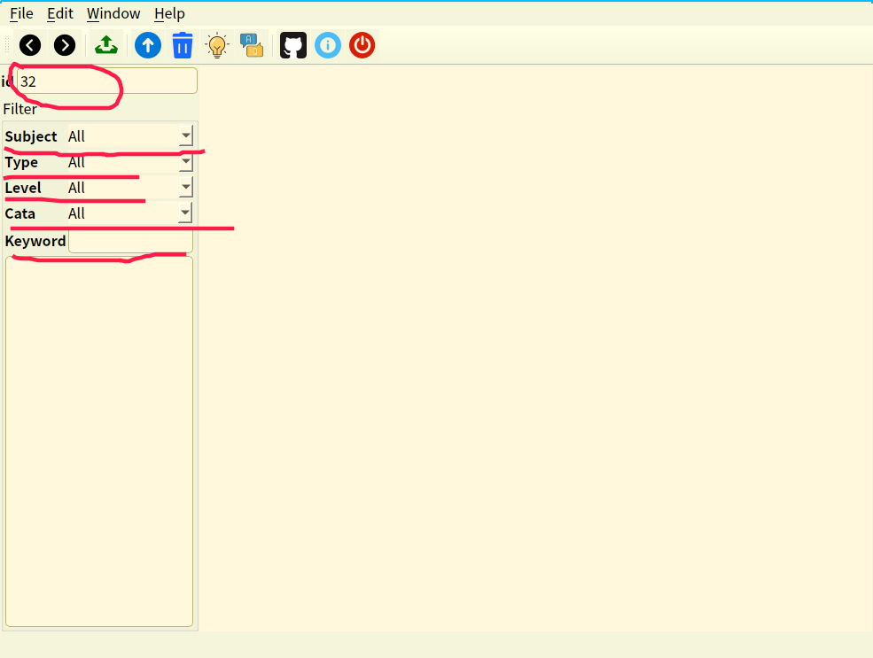

# NJUCS-exercise

NJUCS配套的刷题软件

因为会有公式，为了保证显示效果，推荐pdf导出

软件需要的数据库在release中

## 功能

1、题库数据增删改查；

2、刷题练习；

3、数据分析；

4、题目去重；

5、导出为其他格式文件，如PDF、docx等；

6、提供题目搜索过滤功能；

7、提供填空、选择、解答、判断等题型；

8、正确判断；

文字处理采用HTML格式文本

使用最长句子MD5值进行重复判断

# 配置

OS: Manjaro Linux 18.1.1

Qt: 5.13.1

GCC: 9.2.0

C++: C11

SQL: sqlite3

Git: 2.23.0

# TODO

1、如果data和property表id不一样该如何处理

2、公式只能联网显示的问题

# 软件使用说明

1、主界面

软件默认显示的界面；

可以显示题目，通过点击显示答案和提示；

可以直接修改数据库中的数据（增删改查）；

可以在过滤文本框中填写需要过滤的关键字；

2、副界面

第二界面；

用于添加数据库中没有的数据；

3、皮肤

提供十种皮肤

# 参考资料

本软件所用到的所有资料在doc/参考资料.md中

# Version

## 2019-12-12：

调整数据库结构

## 2019-12-10：

完成基本功能

- 导出功能待完成

## 2019-12-9：

添加过滤题目功能

## 2019-12-8：

添加数据更新功能

保存退出时的ID

## 2019-11-29:

完成两个界面；

实现数据插入；

修复上一题、下一题显示问题；

## 2019-10-24:

从https://github.com/JackeyLea/Warehouse导入仓库软件模板；

完成软件界面；